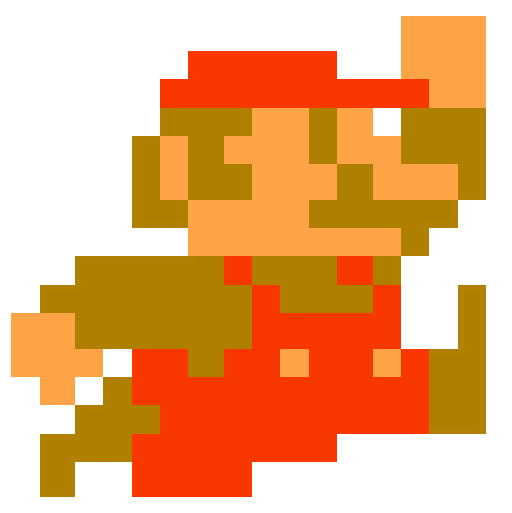

# Not Fancy Mario Jump

A simple, not fancy at all, CSS animated Mario Jump app.

**Features include:**

- Animation with CSS `@keyframes`
- Get Mario to jump using button or spacebar

**Built using:**
- Vue
- Google Fonts - Bangers
- CSS `@keyframes` Animation

<br>

Play around with it on [CodePen](https://codepen.io/samanthaming/pen/qMxQBd)  
Or see it live! [here](https://samanthaming.github.io/not-fancy-css-mario-jump/)

<br>


# Notes

Here are the general steps to create your own Not Fancy Mario Jump. There's not much JavaScipt logic in this app. Most of the heavy lifting is done through CSS `@keyframes`. JavaScipt is mainly used to apply the animation class when the button is clicked.

## 1. Create the `@keyframes` Animation

The first step is to create our animation. This is quite a simple animation. Mainly I'm using the bottom property to move the item.

```css
/* Calling the animation */
.mario.jump img{
  animation-name: jump;
  animation-duration: 1s;
  animation-timing-function: cubic-bezier(.87,-.41,.19,1.44);
}

/* The animation */
@keyframes jump {
  0% {
    bottom: 0;
  }
  50% {
    bottom: 91px;
  }
  100% {
    bottom: 0;
  }
}
```

## 2. Using JavaScript to apply the animation class

This will apply the animation class and trigger the animation.

Here's what it looks like in the _html_ file. This will apply the `jump` class when `isJump` is triggered

```html
<div
  :class="{'jump': isJump}"
>
  
</div>
```

Here's our _vue_ file. This is what the `isJump` data looks like

```javascript
new Vue({
  data: {
    isJump: false,
  },
  methods: {
    jump() {
      this.isJump = true;
    }
  }
})
```

## 3. Remove animation class

Once the animation is completed, we'll remove the animation class. We're utilizing the `animationend` event. This even will fire when a CSS animation has completed. Cool, right! I thought we would need to do some `setTimeOut`, luckily I found this event. Yay! 👏

```html
<div
  @animationend="isJump = false"
>
  
</div>
```

# Resources

- [MDN: animationend](https://developer.mozilla.org/en-US/docs/Web/Events/animationend)
- [JSFiddle: Vue Animation Trigger](https://jsfiddle.net/RobertKirsz/muo19o4x/)
